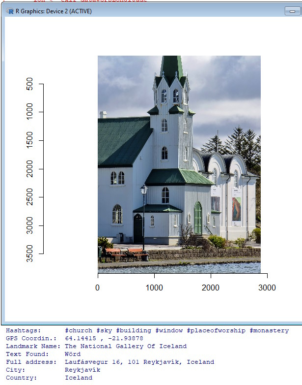

# ImageAI-R
Script to load a local image, use TensorFlow/Keras to identify people, pets and objects, creating tags based on the ImageNet classification database (from a total of 1000 tags available).

There are now 3 types of scripts:
- A **simple** one that uses only a single AI model ([1-AI_image_tag_simple.R](1-AI_image_tag_simple.R));
  
- A more **complex** that uses 15 models at the same time, knowing that depending on the image some models work better than others. This script aims to get the classification tags from those more prevalent and with higher prediction confidence accross all models ([2-AI_image_tag_multimodal.R](2-AI_image_tag_multimodal.R));

- The third script that has all 15 models above, but is also using **Google and Azure Vision AI** (API keys required) to further improve tags and to identify landmarks and addresses ([3-AI_image_multimodal_location.R](3-AI_image_multimodal_location.R));

- Based on all the above knowledge about the image, the forth script looks further at **Google Maps API and Bing Maps API** (API keys required) for the subject of the photo based on GPS data and hashtags found on image, and then finally generating a **prompt for Bing Chat** on the default browser requesting a social media text for easier posting, feeding the AI with probable location and hashtags identified ([4-AI_image_multimodal_location_GPT.R](4-AI_image_multimodal_location_GPT.R)).

