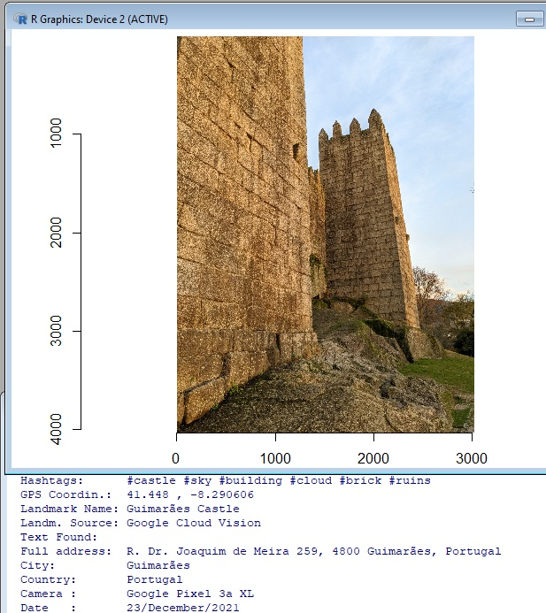
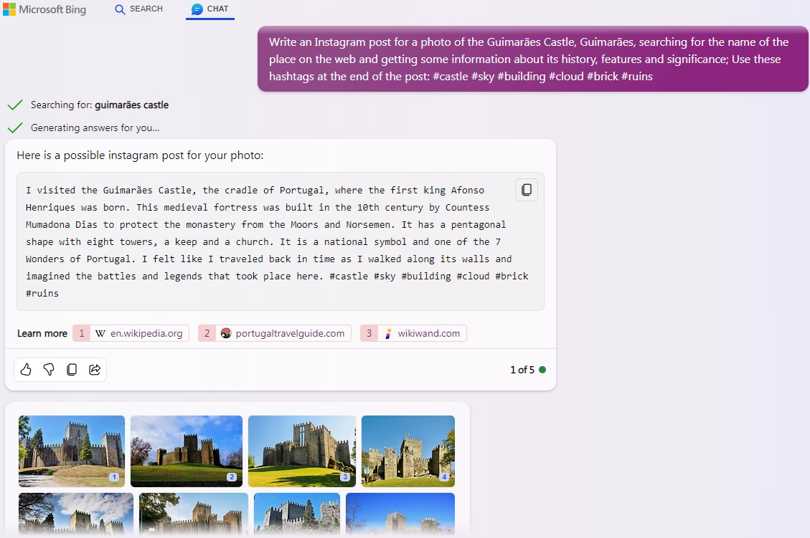

# ImageRecognitionAI-R
ImageRecognitionAI-R is a collection of R scripts that can load an image from a local or online source and recognize various elements in it using AI Image Recognition CNN (<a href="https://en.wikipedia.org/wiki/Convolutional_neural_network">Convolutional Neural Network</a>) models, mostly trained on the <a href="https://en.wikipedia.org/wiki/ImageNet">ImageNet</a> database, which has 1000 categories of objects, people, and animals that could be identified within each image. The last script (number 4) also attempts to detect the location or landmark in the image based on <a href="https://cloud.google.com/vision/">Google Cloud Vision AI</a>, <a href="https://azure.microsoft.com/en-us/products/ai-services/ai-vision">Azure Vision AI</a>, <a href="https://developers.google.com/maps/documentation/places/web-service/overview">Google Places API</a> and <a href="https://www.microsoft.com/en-us/maps/bing-maps/location-recognition">Bing Location Recognition API</a>.

Based on the image recognition tags and location data gathered, ImageRecognitionAI-R script 4 also automatically creates a prompt for <a href="https://www.bing.com/chat">Bing Chat</a>, which can generate a social media post using AI.

<ins>**There are 4 types of scripts:**</ins>
- A **simple** one that uses only a single AI model for image recognition ([1-AI_image_tag_simple.R](1-AI_image_tag_simple.R));
  
- A second (**more complex**) one that does image recognition using 15 AI models at the same time, based on the knowledge that, depending on what is contained in the image, some models work better than others. This script aims to get the classification tags from those that are more prevalent and with higher prediction confidence accross all models ([2-AI_image_tag_multimodal.R](2-AI_image_tag_multimodal.R));

- The third script still uses all the previous 15 AI models, but is also using **Google and Azure Vision AI** (API keys required) to further improve tags and to identify landmarks and addresses ([3-AI_image_multimodal_location.R](3-AI_image_multimodal_location.R));

- Based on all the above knowledge about the image, the forth script improves the results further by also using **Google Maps API and Bing Maps API** (API keys required) to more accurately search for the location or landmark name based on GPS data and hashtags found on image. Finally, it generates a **prompt for Bing Chat** on the default browser requesting a social media text for easier posting, feeding the AI with probable location and hashtags identified ([4-AI_image_multimodal_location_GPT.R](4-AI_image_multimodal_location_GPT.R)).

# Image recognition AI models being used:
- MobileNetV3
- VGG16
- VGG19
- ResNet-50
- ResNet-101
- ResNet-152
- ResNet50V2
- ResNet101V2
- ResNet152V2
- DenseNet201
- Xception
- Inception-ResNet-v2
- Inception-V3
- NasNetLarge
- EfficientNet B7
- Azure Vision AI
- Google Cloud Vision
